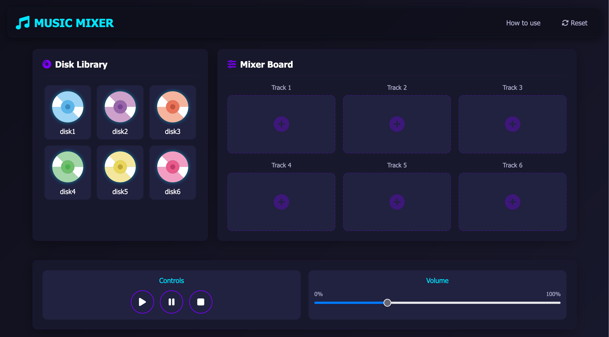

# Interactive Music Mixer Web App

This is the repo of the Music-Mixer Assignment for MMED-1055-(01)-25S - Multimedia Authoring 2.

## Overview

A browser-based audio mixing tool that allows users to drag and drop sound clips to create custom music compositions. This project focuses on:

- Web Audio API integration
- HTML5 Drag-and-Drop functionality
- Responsive visual design
- Interactive UI animations

## Project Structure

### GRADING RUBRIC

- Folder Setup & Naming: 1
- GitHub Best Practices: 4
- Design/Layout: 5
- Research/Planning: 5
- Functionality, Interactivity and Formatting: 10
- Presentation: 5

## Installation

No installation required.

## Usage

To uses, open index.html in the browser of your choice.

## Contributing

1. Fork it!
2. Create your feature branch: `git checkout -b my-new-feature`
3. Commit your changes: `git commit -am 'Add some feature'`
4. Push to the branch: `git push origin my-new-feature`
5. Submit a pull request :D

## Credits

Yi Cheng
